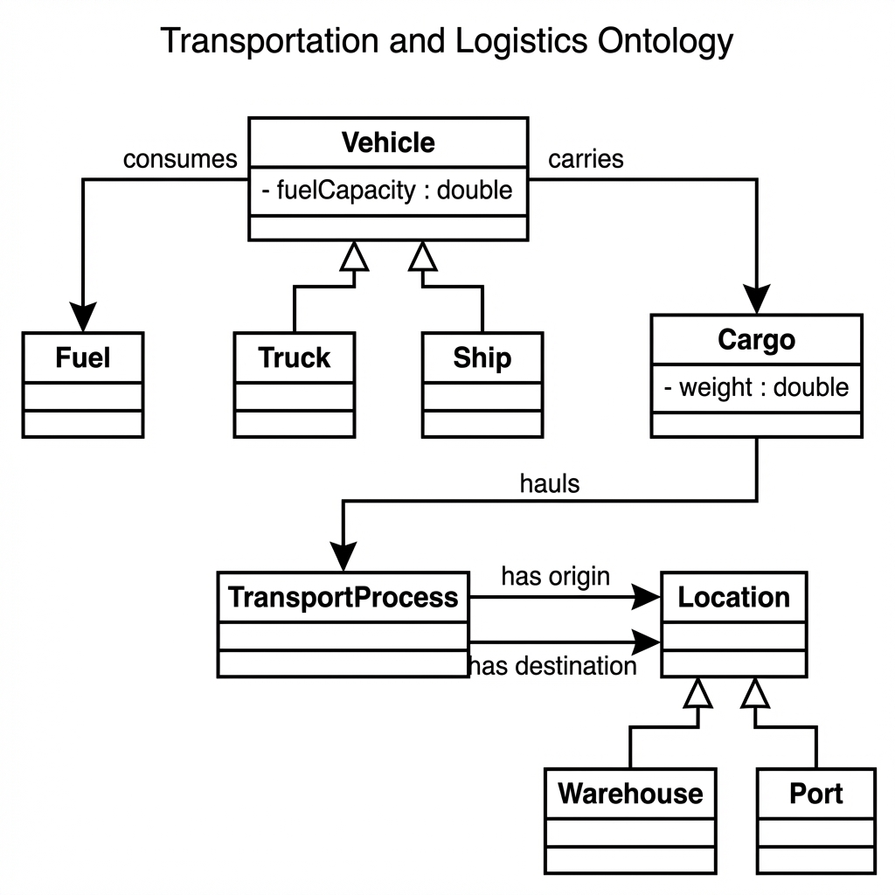
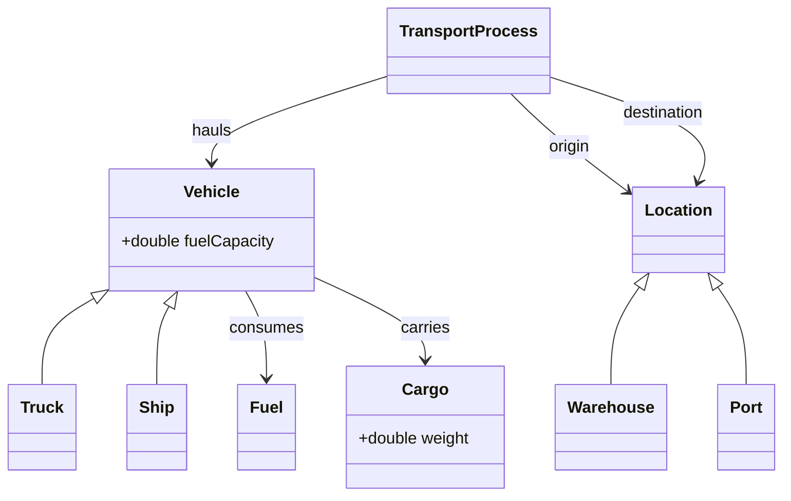

# Project Report: Transportation and Logistics Ontology

**Author:** Abrham Assefa
**Serial No.:** VR548223
**Course:** HCI (Human Computer Interaction)
**Date:** February 8, 2026


## 1. Introduction

This project presents a semantic ontology designed for the **Transportation and Logistics** domain. The primary goal is to model the relationships between vehicles, cargo, fuel sources, and locations to facilitate automated reasoning and data interoperability. The ontology is implemented in **OWL 2.0 (Web Ontology Language)** .

## 2. Methodology

The ontology was developed using a top-down approach, defining high-level classes before specializing them into subclasses.

### Key Technologies:
- **Language:** OWL 2.0
- **Syntax:** RDF/XML
- **Tools:** Protégé (for design), HermiT (for reasoning)

## 3. Ontology Structure (Taxonomy)

The ontology defines the following core class hierarchy:

- **`Vehicle`**: Base class for all transport means.
    - `Truck`: Land-based transport vehicle.
    - `Ship`: Maritime transport vehicle.
- **`Location`**: Geographic points relevant to logistics.
    - `Warehouse`: Storage facility.
    - `Port`: Maritime docking facility.
- **`Cargo`**: The goods being transported.
- **`Fuel`**: Energy source for vehicles.
- **`TransportProcess`**: The event of moving goods from Origin to Destination.

## 4. Relationships (Object Properties)

The following semantic relationships connect the classes:

| Property | Domain | Range | Description |
| :--- | :--- | :--- | :--- |
| `consumes` | Vehicle | Fuel | Defines the fuel type a vehicle uses. |
| `carries` | Vehicle | Cargo | Links a vehicle to the goods it transports. |
| `hauls` | TransportProcess | Vehicle | Specifies which vehicle connects a shipment. |
| `origin` | TransportProcess | Location | Starting point of a shipment. |
| `destination` | TransportProcess | Location | Ending point of a shipment. |

## 5. Visual Representation

Here is the visual class diagram for the ontology:



### Mermaid Conceptual Diagram



## 6. Competency Questions (Usage Scenarios)

The ontology is designed to answer the following key competency questions, proving its utility:

1.  **"What fuel does a specific vehicle consume?"**
    - *Answered by:* The `consumes` property linking `Vehicle` to `Fuel`.
2.  **"Where is a shipment currently moving from and to?"**
    - *Answered by:* Tracking the `TransportProcess` via `origin` and `destination`.
3.  **"Which vehicles are capable of carrying heavy cargo?"**
    - *Answered by:* Filtering `Vehicle` instances based on the `carries` property and `fuelCapacity`.

## 7. Example SPARQL Queries

Here are example queries demonstrating how to retrieve data from the ontology:

**Query 1: List all Vehicles and their Fuel Type**
```sparql
PREFIX tlo: <http://www.semanticweb.org/transportation-logistics-ontology#>
SELECT ?vehicle ?fuel
WHERE {
  ?vehicle tlo:consumes ?fuel .
}
```

**Query 2: Find all Trucks carrying Cargo over 1000kg**
```sparql
PREFIX tlo: <http://www.semanticweb.org/transportation-logistics-ontology#>
SELECT ?truck ?cargo ?weight
WHERE {
  ?truck a tlo:Truck ;
         tlo:carries ?cargo .
  ?cargo tlo:weight ?weight .
  FILTER (?weight > 1000)
}
```

## 8. Conclusion

To wrap things up, this project effectively maps out the core elements of the logistics industry—like vehicles, locations, and cargo—into a structured digital format. By setting up these rules in OWL, we're basically teaching the computer how to understand shipping constraints, like knowing that ships dock at ports or calculating fuel needs for a trip. It’s a solid first step towards building smarter systems that can automatically flag errors or optimize supply chains, showing just how powerful semantic web technologies can be in real-world scenarios.

---
**Appendix: OWL Source Code**
The full OWL 2.0 source code is attached in the file `transportation_ontology.owl`.
